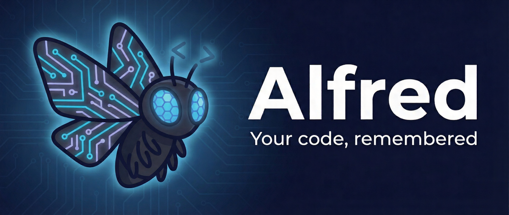

# Alfred

<p align="center">
  
</p>

<p align="center">
  <strong>Alfred remembers so you don't have to</strong>
</p>

<p align="center">
  <a href="https://github.com/jeremysball/alfred/actions/workflows/ci.yml">
    
  </a>
  <a href="https://github.com/jeremysball/alfred/releases">
    
  </a>
  <a href="LICENSE">
    
  </a>
  <a href="https://pypi.org/project/alfred-assistant/">
    
  </a>
</p>

---

Alfred is a persistent memory system for LLMs. He stores your conversations locally, searches them semantically, and injects relevant context into prompts automatically. Chat via Telegram or CLI.

## Quick Start

```bash
pip install alfred-assistant

# Set up environment
export TELEGRAM_BOT_TOKEN=your_token
export OPENAI_API_KEY=your_key
export KIMI_API_KEY=your_key
export KIMI_BASE_URL=https://api.kimi.com/coding/v1

# Start chatting
alfred
```

On first run, Alfred creates default context files in `data/` from built-in templates.

## What It Does

LLMs forget everything when you close the chat. Alfred solves this by:

1. **Storing** every conversation to `data/memory/memories.jsonl` with embeddings
2. **Searching** semantically when you ask a question
3. **Injecting** relevant context into the LLM prompt automatically

All local. No cloud. Your data stays in files you control.

## Features

- **Persistent Memory** — JSONL files with OpenAI embeddings
- **Semantic Search** — Find relevant context instantly
- **Telegram Bot** — Chat anywhere
- **CLI** — Terminal interface with streaming
- **Scheduled Jobs** — "Remind me every morning at 8am"
- **File Tools** — Read, write, edit, bash execution
- **Human Approval** — Jobs require approval before running
- **Auto-Setup** — Templates copy to `data/` on first run

## CLI Commands

```bash
alfred              # Start interactive chat
alfred --telegram   # Run as Telegram bot
alfred cron list    # List scheduled jobs
alfred cron submit  # Submit a new job
alfred --debug info # Run with info logging
```

## Data Storage

```
data/
├── memory/
│   └── memories.jsonl      # Conversations with embeddings
├── cron.jsonl              # Scheduled jobs
├── cron_history.jsonl      # Job execution history
├── cron_logs.jsonl         # Job output logs
├── AGENTS.md               # Agent behavior rules
├── SOUL.md                 # Alfred's personality
├── USER.md                 # User preferences
└── TOOLS.md                # Tool definitions
```

## Configuration

Environment variables (required):

| Variable | Description |
|----------|-------------|
| `TELEGRAM_BOT_TOKEN` | Telegram Bot API token |
| `OPENAI_API_KEY` | OpenAI API key (embeddings) |
| `KIMI_API_KEY` | Kimi API key |
| `KIMI_BASE_URL` | Kimi API endpoint |

Optional:

| Variable | Default | Description |
|----------|---------|-------------|
| `DEFAULT_LLM_PROVIDER` | `kimi` | LLM provider |
| `EMBEDDING_MODEL` | `text-embedding-3-small` | Embedding model |
| `CHAT_MODEL` | `kimi-k2-5` | Chat model |
| `MEMORY_CONTEXT_LIMIT` | `20` | Max memories in context |

## Documentation

- [Architecture](docs/ARCHITECTURE.md) — System design and components
- [API Reference](docs/API.md) — Module documentation
- [Deployment](docs/DEPLOYMENT.md) — Production setup
- [Cron Jobs](docs/cron-jobs.md) — Scheduled tasks
- [Roadmap](docs/ROADMAP.md) — Development progress

## Community

- [GitHub Discussions](https://github.com/jeremysball/alfred/discussions)
- [GitHub Issues](https://github.com/jeremysball/alfred/issues)

## License

MIT

---

<p align="center">Made with ❤️ and 🧠</p>
