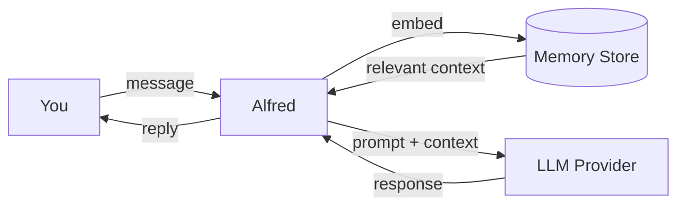

# Alfred


**Alfred manages context intelligently.**

Not just memory. He knows what matters, when to bring it up, and what connects to now. Other assistants start fresh every time. Alfred builds a relationship with you.

## Why This Matters

You know that feeling when you start a new ChatGPT conversation and have to explain your entire project from scratch? Or when you mention a preference you've stated ten times before?

Alfred doesn't make you repeat yourself.

```
You: What did we decide about the database?

Alfred: You went with PostgreSQL over SQLite last Tuesday. The main reasons were:
- You need concurrent access (5+ users)
- JSONB queries for the metadata field
- Your team already knows Postgres

You also picked UUIDs for primary keys. Want me to pull up the full conversation?
```

That's not a transcript. That's Alfred actually remembering.

## Your Data Stays With You

Alfred runs on your machine. Your conversations never leave. No cloud storage, no corporate servers, just your files on your computer.

And you don't configure Alfred. You just talk to him. Tell him your preferences, your projects, how you communicate. He learns. He adapts. No YAML files to edit, no slash commands to memorize.

## Getting Started

```bash
pip install alfred-ai
export KIMI_API_KEY=your_key
export OPENAI_API_KEY=your_key
alfred
```

Then just start talking.

## How It Works



Every message gets embedded and stored. When you talk, Alfred searches by meaning, not keywords, and pulls the right context into your session.

Over time, he learns what matters. Which details are important. How you think. The context he brings isn't just relevant. It's intelligent.

## What Alfred Does

**Manages context intelligently.** Brings the right information forward at the right time, without being asked.

**Works with tools.** Alfred can read your files, write code, and run shell commands when you ask.

**Fits your workflow.** Chat in your terminal or through Telegram.

**Plays nice with others.** Works with Kimi, OpenAI, or any OpenAI-compatible API.

## Contributing

Alfred is young but useful. If you want to help:

- Make him smarter about what to remember
- Improve how he learns your preferences over time
- Add better test coverage
- Build conversation summarization for long chats

Check [AGENTS.md](AGENTS.md) for how we work. Pull requests and issues welcome.

## License

MIT
