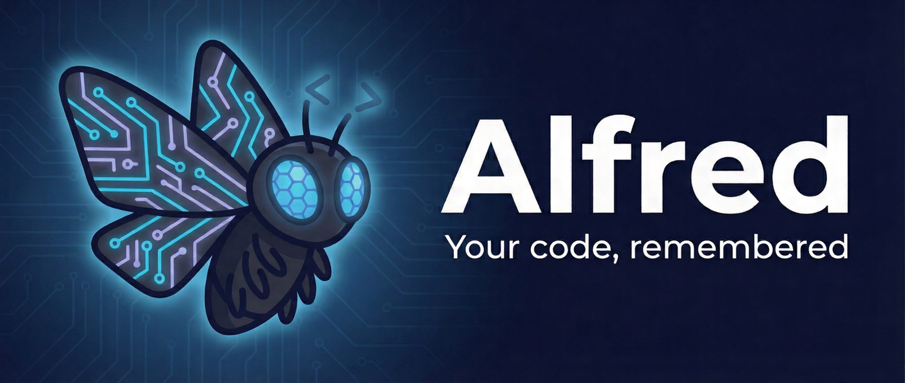

# Alfred

<p align="center">
  
</p>

<p align="center">
  <strong>A local-first relational support system for action, decisions, and reflection.</strong>
</p>

<p align="center">
  <a href="https://github.com/jeremysball/alfred/actions/workflows/ci/python.yml">
    
  </a>
  <a href="https://github.com/jeremysball/alfred/actions/workflows/ci/javascript.yml">
    
  </a>
  <a href="https://github.com/jeremysball/alfred/releases">
    
  </a>
  <a href="LICENSE">
    
  </a>
  <a href="https://pypi.org/project/alfred-assistant/">
    
  </a>
</p>

---

Alfred is an open-source AI companion with memory, tools, and continuity.

He is being built to feel less like a disposable chat window and more like a persistent presence: someone who can help you **plan**, **execute**, **decide**, **review**, and **reflect** without starting from zero every time.

Today, Alfred already has a strong local foundation: durable context files, searchable memory, full session history, tools, a Web UI, a terminal interface, and a runtime self-model. The next layer now being formalized is what makes him more than a memory wrapper: a relational support system that can show up as a **friend**, **peer**, **mentor**, **coach**, or **analyst** without splitting into crude mode toggles.

> **Status:** Beta. Active development. Breaking changes are expected while the support model is being unified.

## Why Alfred exists

Most AI chat products are good at isolated turns and bad at continuity.

They forget:
- what matters to you
- what you were in the middle of
- what usually helps when you get stuck
- what patterns keep repeating
- what kind of presence you actually want on the other side of the conversation

Alfred is an attempt to fix that.

The goal is not only better memory. The goal is a system that can hold:
- **operational continuity** — projects, tasks, open loops, decisions
- **relational continuity** — a real sense of ongoing companionship
- **support continuity** — learning how to help you better over time
- **reflective continuity** — noticing patterns without flattening you into a diagnosis or template

## What makes Alfred different

### 1. Local-first memory you control
Alfred stores his support context locally: managed markdown files, remembered facts, and session history live in your Alfred data directory, not in some opaque hosted product memory layer.

### 2. One system, many kinds of support
Alfred is being designed around shared primitives rather than niche modes. The same system should handle:
- action support
- decision support
- review
- identity reflection
- direction reflection

### 3. Relational by design
Alfred is not meant to sound like a sterile assistant. He is meant to feel like a companion: friend, peer, and sometimes mentor or coach, depending on the moment.

### 4. Learnable and correctable
The long-term direction is not just "remember more." It is "learn what kind of help works, show your work, and let the user correct it."

## Current foundation vs planned support model

| Today | In progress / planned |
|---|---|
| Always-loaded context files (`SYSTEM.md`, `AGENTS.md`, `SOUL.md`, `USER.md`) | Operational support memory for projects, tasks, open loops, and decisions |
| Curated remembered facts with semantic retrieval | Relational and support profiles that adapt by context and project |
| Searchable session archive | Episode-based learning instead of coarse session-only learning |
| Web UI and terminal interfaces | Bounded review cards and correction surfaces |
| Tool use, cron, and runtime self-model | Richer relational stance composition: friend / peer / mentor / coach / analyst |

See:
- [How Alfred Helps](docs/how-alfred-helps.md)
- [Relational Support Model](docs/relational-support-model.md)
- [Roadmap](docs/ROADMAP.md)

## What Alfred should eventually feel like

Not a chatbot that happens to remember a few facts.

More like a persistent companion who can do things like:
- help you start the annoying admin task you keep avoiding
- tell you what is actually active and what is still open
- compare two paths and make a real recommendation
- notice when a goal sounds inherited rather than chosen
- keep track of what kind of help works for you in different situations
- surface patterns back to you in a way you can confirm, reject, or refine

## Example interactions

### Action support
> **You:** Help me start this. I keep putting it off.  
> **Alfred:** Don't solve the whole thing. Open the tab first. If the page loads, we've already broken the seal.

### Decision support
> **You:** Which option feels more like me?  
> **Alfred:** The safer path sounds more legible. The other one sounds more alive. If you want my honest read, I think you're trying to negotiate with a future you already don't want.

### Review
> **You:** What am I actually in the middle of right now?  
> **Alfred:** Three active threads: the Web UI cleanup, the support-model docs sweep, and the startup-direction question you still haven't really closed.

### Reflection
> **You:** What have you learned about how to help me?  
> **Alfred:** In execution contexts, narrower prompts work better than menus. In reflection contexts, you go deeper when I act more like a candid peer than a formal advisor.

## Quick start

### Install

```bash
uv tool install alfred-assistant
```

### Configure

Set the environment you need. Kimi is the default chat provider.

```bash
export KIMI_API_KEY=your_key
export KIMI_BASE_URL=https://api.kimi.com/coding/v1

# Optional: required only for OpenAI embeddings
export OPENAI_API_KEY=your_key
```

### Run

```bash
# Terminal UI
alfred

# Web UI
alfred webui
```

On first run, Alfred creates his managed context files and local data directories automatically.

## Core commands

```bash
alfred                   # Start interactive terminal chat
alfred webui             # Start the browser interface
alfred --telegram        # Run Telegram mode
alfred cron list         # List scheduled jobs
alfred cron submit       # Submit a new scheduled job
alfred memory status     # Show memory store status
alfred memory migrate    # Migrate or rebuild memory storage
```

## Interfaces

### Web UI
The Web UI is the easiest way to use Alfred if you want a modern chat surface with streaming, tool visibility, and persistent sessions.

Highlights:
- real-time streaming
- persistent sessions
- reasoning and tool-call display
- status bar, notifications, keyboard shortcuts
- browser-based chat without losing Alfred's memory model

Start it with:

```bash
alfred webui --open
```

### Terminal UI
The terminal interface is for people who want Alfred close to their shell and workflow.

Highlights:
- streaming responses
- persistent sessions
- strong keyboard flow
- direct fit for local development and debugging

### Telegram
Telegram support still exists, but current product direction is centered on the local interfaces.

## Memory at a glance

Alfred's memory model is moving toward a full support system, but the current foundation is already useful.

### Always-loaded files
These shape behavior every turn:
- `SYSTEM.md`
- `AGENTS.md`
- `SOUL.md`
- `USER.md`

### Curated memory
Facts Alfred deliberately remembers because they are likely to matter again.

### Session archive
Searchable history of prior conversations and tool outcomes.

### Planned support memory
The next layer adds:
- projects
- tasks
- open loops
- relational/support preferences
- episode-based learning
- bounded reflection and correction

For the current and planned model, see [docs/MEMORY.md](docs/MEMORY.md).

## Documentation map

### Start here
- [How Alfred Helps](docs/how-alfred-helps.md) — user-facing view of the planned support model
- [Relational Support Model](docs/relational-support-model.md) — developer-facing model of support, learning, and reflection
- [Architecture](docs/ARCHITECTURE.md) — current foundation plus target support architecture
- [Memory System](docs/MEMORY.md) — current memory foundation plus support-memory direction

### Runtime and interfaces
- [WebSocket Protocol](docs/websocket-protocol.md) — Web UI real-time communication
- [Self-Model & Introspection](docs/self-model.md) — Alfred's internal self-model and `/context`
- [Cron Jobs](docs/cron-jobs.md) — scheduled jobs and reminders
- [Deployment](docs/DEPLOYMENT.md) — production setup

### Project direction
- [Roadmap](docs/ROADMAP.md) — current milestones and open PRDs
- [Template Sync and Conflict Recovery](docs/template-sync.md) — managed template drift and repair
- [API Reference](docs/API.md) — module documentation

## Contributing

Alfred is in active development. The architecture is still being cleaned up and unified. Small, clear changes are preferred over heroic rewrites.

### Development setup

```bash
git clone https://github.com/jeremysball/alfred.git
cd alfred
uv sync
npm install
```

### Validation workflows

#### Python changes
```bash
uv run ruff check src/
uv run mypy --strict src/
uv run pytest <targeted tests>
```

#### JavaScript changes
```bash
npm run js:check
```

Rule of thumb:
- Python-only change → run the Python workflow
- JavaScript-only change → run the JavaScript workflow
- Both touched → run both

## Community

- [GitHub Discussions](https://github.com/jeremysball/alfred/discussions)
- [GitHub Issues](https://github.com/jeremysball/alfred/issues)

## License

MIT

---

<p align="center">Built for continuity, judgment, and companionship.</p>
