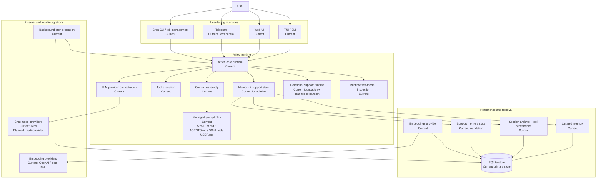
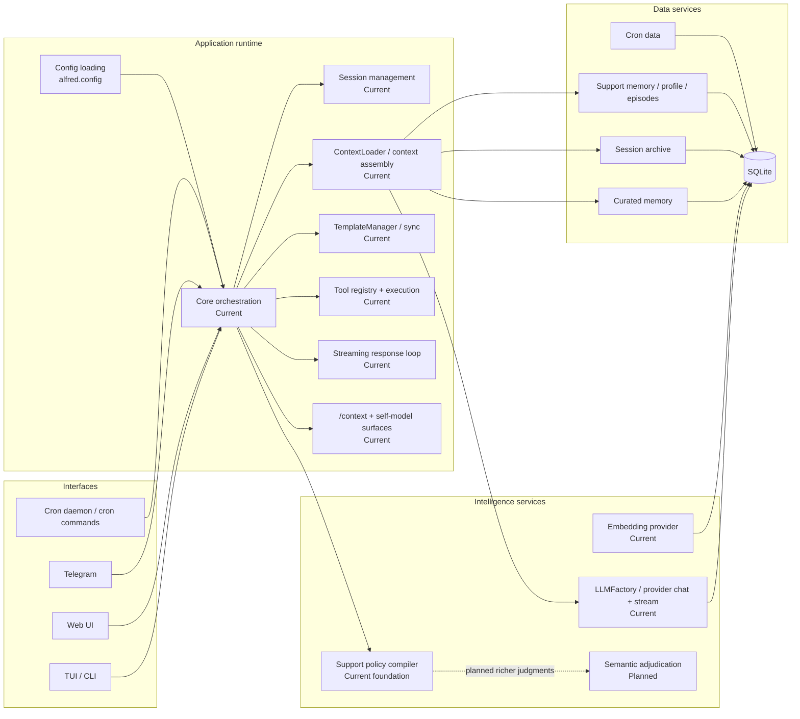
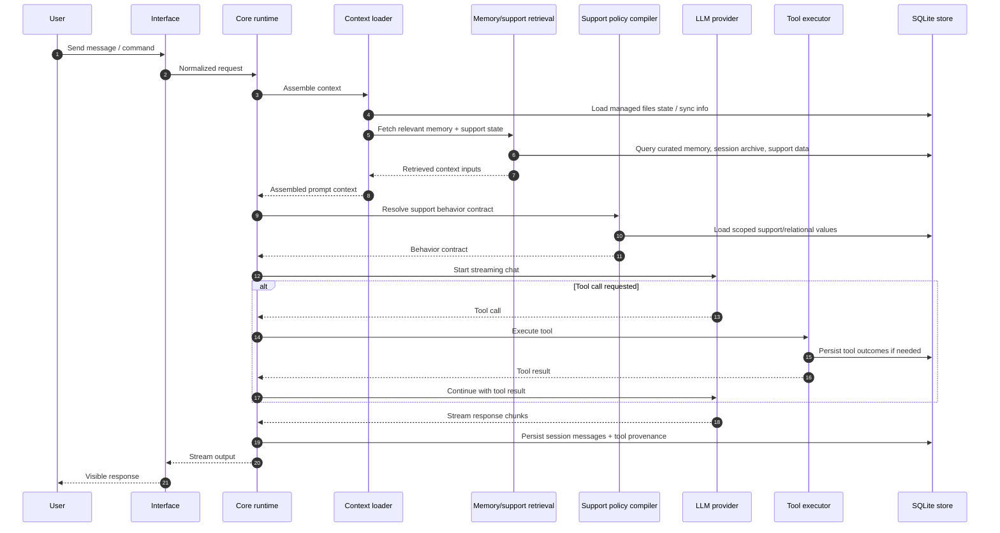
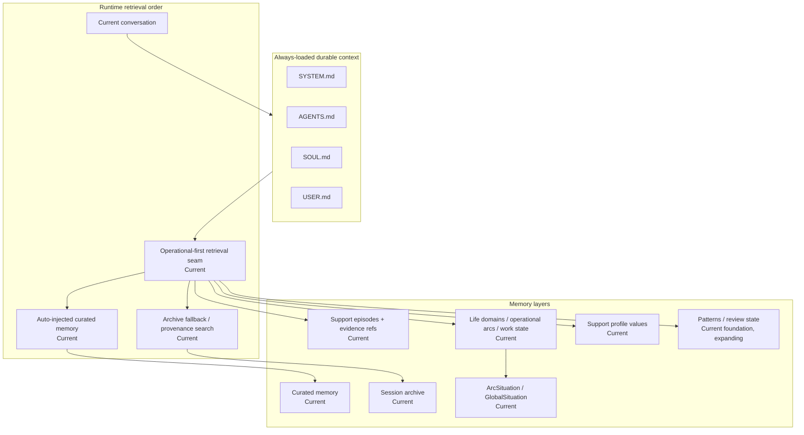
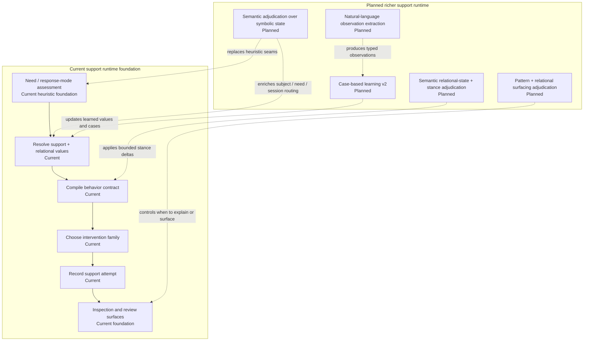
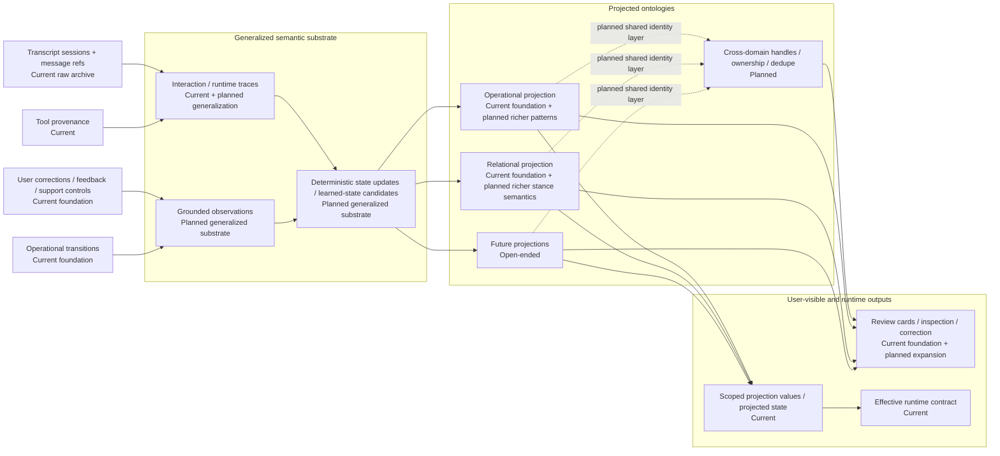
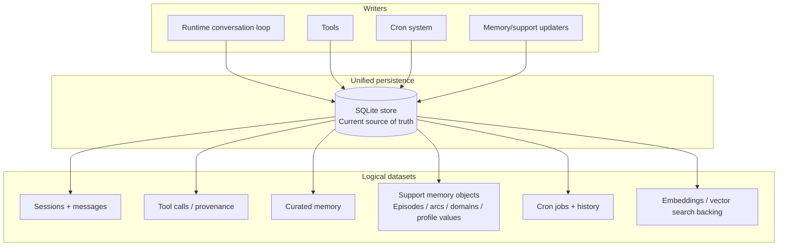
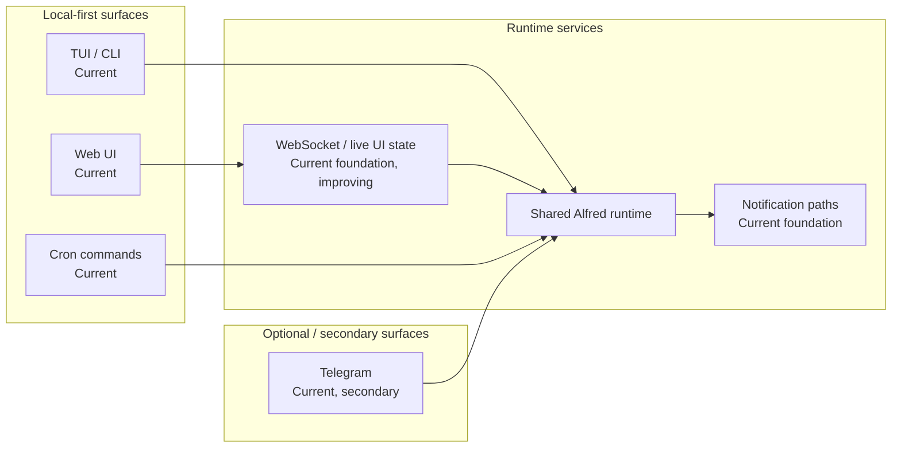
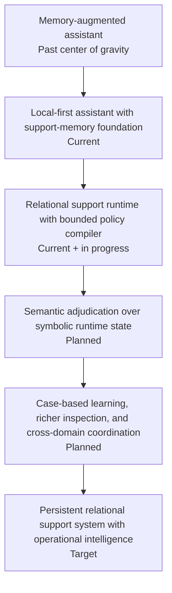
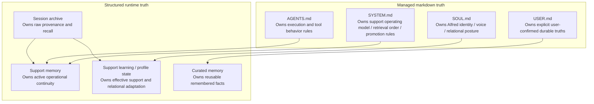

# Alfred Architecture Diagrams

## 1. System context

## 2. Current runtime container view

## 3. Current turn flow

## 4. Current memory and continuity architecture

## 5. Current support runtime vs planned support runtime

## 6. Planned learning and evidence architecture

## 7. Current storage architecture

## 8. Interface and transport view

## 9. Planned architecture trajectory map

## 10. Ownership map

