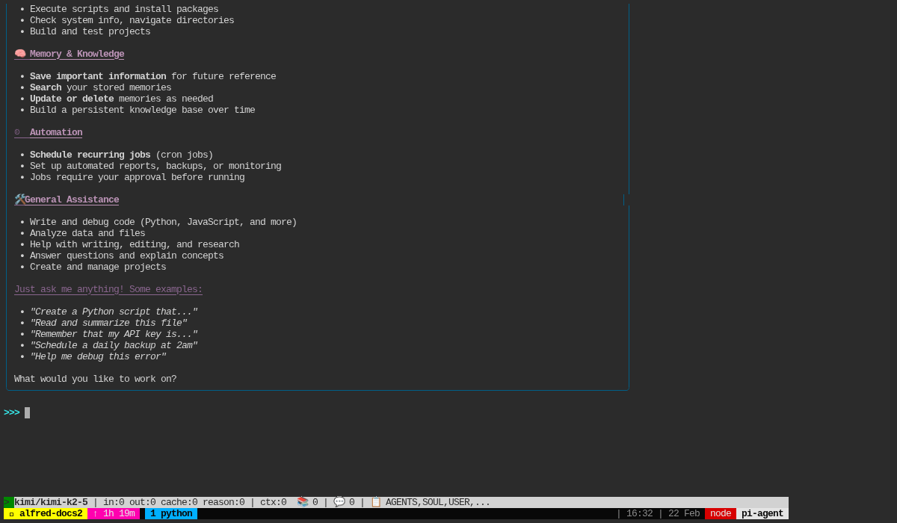
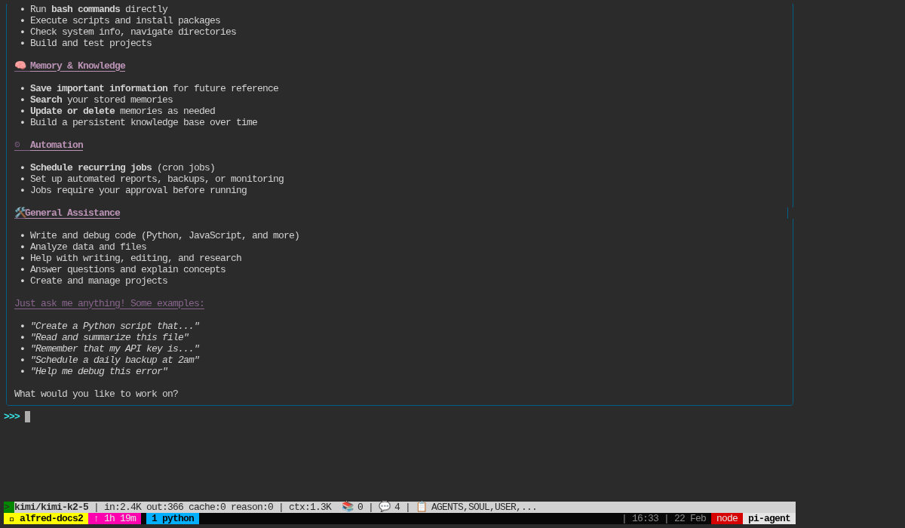
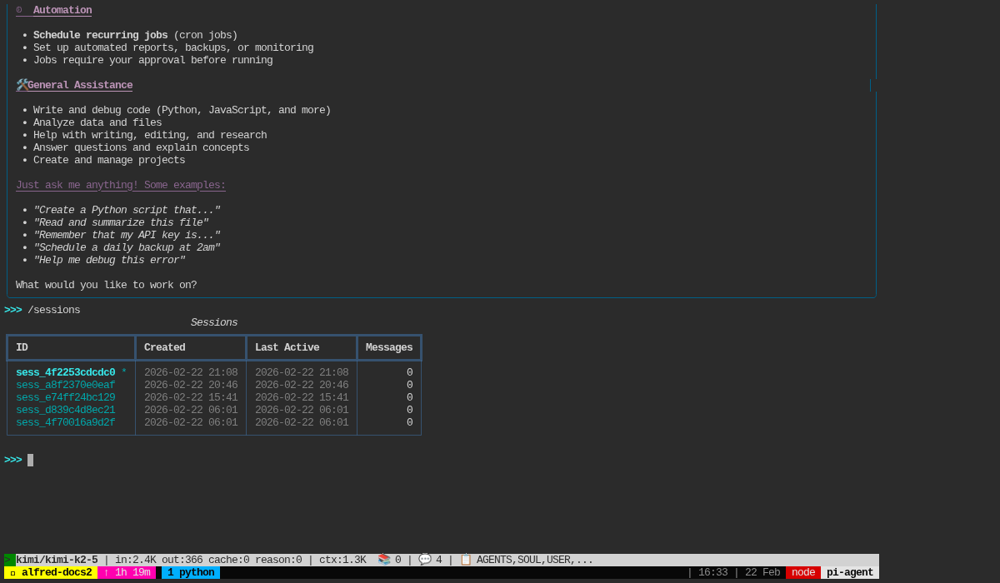
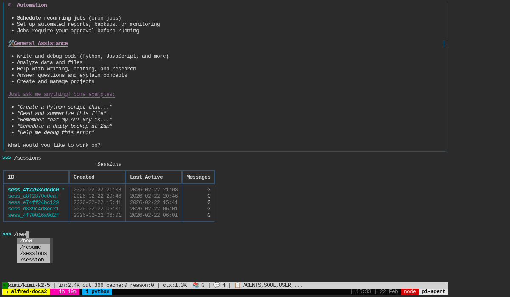

# Alfred CLI UI Design Document

**Created**: 2026-02-22
**PRD**: #87 Session UX Polish
**Purpose**: Visual reference for Alfred CLI UI patterns and behaviors

---

## Overview

Alfred's CLI interface uses **Rich** for rendering and **prompt_toolkit** for input handling. The UI prioritizes:

- **Clarity**: Distinct visual separation between user and assistant messages
- **Responsiveness**: Streaming output with live updates
- **Context visibility**: Status line showing model, tokens, and session state

### Technology Stack

| Component | Library | Purpose |
|-----------|---------|---------|
| Layout | Rich Console | Terminal rendering |
| Panels | Rich Panel | Message containers with borders |
| Markdown | Rich Markdown | Formatting assistant responses |
| Input | prompt_toolkit | Prompt with completion, keybindings |
| Live updates | Rich Live | Streaming content |
| Status | prompt_toolkit bottom_toolbar | Token/context display |

---

## Screenshots

### 1. Startup State

The initial view when Alfred launches - banner, empty prompt, and status line.



**Key elements:**
- Banner panel with title and keybindings hint
- Empty prompt (`>>> `)
- Status line showing model, tokens, and context

### 2. Conversation State

Messages displayed as colored panels after a conversation.



**Panel styling:**
- **User messages**: Slate blue border (`color(23)`)
- **Assistant messages**: Dark teal border (`color(24)`)
- Left-aligned titles ("You" / "Alfred")

### 3. Session Commands

The `/sessions` command shows all available sessions in a table.



**Commands:**
- `/new` - Create new session
- `/resume <id>` - Resume existing session
- `/sessions` - List all sessions
- `/session` - Show current session info

### 4. Command Completion

Tab completion shows available commands.



Type `/` then press `Tab` to see: `/new`, `/resume`, `/sessions`, `/session`.

---

## UI Components

### Message Panels

All conversation messages use Rich `Panel` with consistent styling:

```python
# User message
Panel(
    content,
    title="You",
    title_align="left",
    border_style="color(23)",  # Dark slate blue
    padding=(0, 1),
)

# Assistant message
Panel(
    Markdown(content),
    title="Alfred",
    title_align="left",
    border_style="color(24)",  # Dark teal
    padding=(0, 1),
)
```

### Tool Panels

Tool calls appear with their results:

```python
Panel(
    content,
    title=f"Tool: {tool_name}",
    title_align="left",
    border_style="red" if is_error else "dim blue",
    padding=(0, 1),
)
```

### Status Line

Bottom toolbar showing context (via `prompt_toolkit` `bottom_toolbar`):

```
> kimi/kimi-k2-5 | in:4.0K out:36 cache:0 reason:0 | ctx:2.9K  📚 1 | 💬 40 | 📋 AGENTS,SOUL,USER,...
```

| Field | Description |
|-------|-------------|
| `>` | Activity indicator (streaming: animated spinner) |
| `kimi/kimi-k2-5` | Current model name |
| `in:X` | Input tokens consumed |
| `out:X` | Output tokens generated |
| `cache:X` | Cache read tokens (if any) |
| `reason:X` | Reasoning tokens (if any) |
| `ctx:X` | Estimated context size |
| `📚 N` | Memories in context |
| `💬 N` | Session messages |
| `📋 ...` | Prompt sections loaded |

### Throbber

Right-aligned animated spinner during streaming. Uses `dots` spinner frames at 80ms interval:

```python
SPINNER_FRAMES = "⠋⠙⠹⠸⠼⠴⠦⠧⠇⠏"
```

---

## Interactions

### Keybindings

| Key | Action |
|-----|--------|
| `Ctrl-T` | Toggle tool panel visibility |
| `Tab` | Complete commands/session IDs |
| `Enter` | Submit message |
| `Ctrl-C` | Interrupt/exit |

### Commands

| Command | Description |
|---------|-------------|
| `/new` | Create new session |
| `/resume <id>` | Resume existing session |
| `/sessions` | List all sessions |
| `/session` | Show current session info |
| `exit` | Quit Alfred |
| `compact` | Compact context |

---

## Implementation Files

| File | Purpose |
|------|---------|
| `src/interfaces/cli.py` | Main CLI interface, panels, completer |
| `src/interfaces/status.py` | Status line rendering |
| `src/interfaces/notification_buffer.py` | Job notification queuing |

---

## Future Improvements

Identified during PRD #87 implementation:

1. **Shift+Enter queue message** - Allow queuing messages while LLM is running
2. **ESC cancel streaming** - Interrupt current LLM call
3. **Background color on panels** - Full background styling (Rich limitation)
4. **Session ID short form** - Allow partial ID matching for `/resume`

---

## References

- PRD #53: Session System
- PRD #81: Enhanced CLI Status Line
- PRD #87: Session UX Polish
- [Rich Documentation](https://rich.readthedocs.io/)
- [prompt_toolkit Documentation](https://python-prompt-toolkit.readthedocs.io/)
